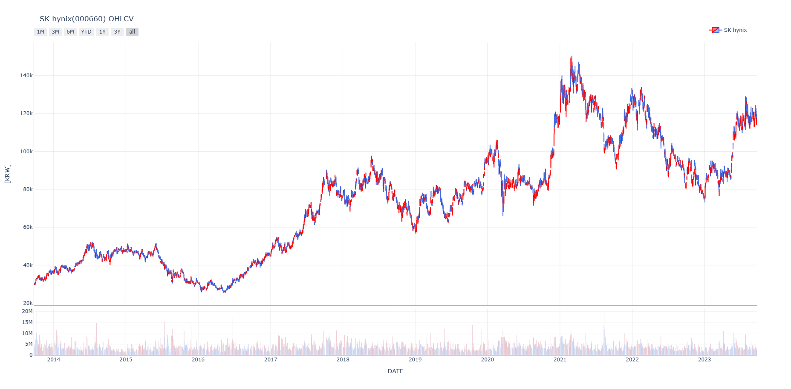
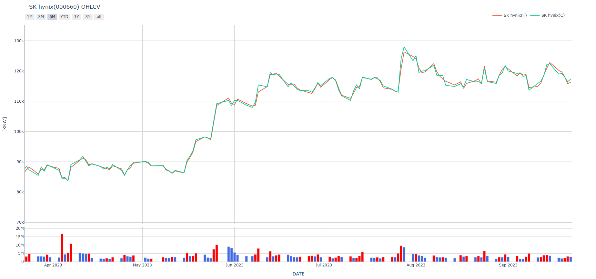

# labwons : Laboratory ￦ons - Snowball Your Asset.

한국 및 미국 유가 증권에 대한 시장 데이터의 편리한 접근 및 시각화를 위해 제작된 라이브러리입니다. <br><br>
데이터 제공처는 제공하는 데이터의 <b>수집(데이터베이스화) 및 영리 목적의 사용을 금하고 있으며</b> 이를 어길 시 법적 책임을 물을 수 있습니다. 이에 따라 사용자는 개인 투자 참고 목적으로 본 라이브러리를 활용해야 하며, 이외의 활용 목적에 대한 법적 책임은 사용자 본인에게 있습니다. 제공되는 데이터는 신뢰할만 하나, 무결성을 보장하지는 않으며 이에 대한 법적 책임을 지지 않습니다. 모든 투자의 책임은 투자자 본인에게 있습니다.

---

# 환경 설정
## 설치 방법
* 배포 후 기입 예정

## 요구 라이브러리(Dependencies)
본 라이브러리를 사용하기 위해 선행적으로 필요한 파이썬 라이브러리가 있습니다. 요구 라이브러리 부재 시 요구 기능이 동작하지 않거나 일부 기능이 제한될 수 있습니다. 요구 라이브러리는 설치 시 함께 설치하도록 설정되어 있으나 설치 환경에 따라 설치가 이루어지지 않을 시 수동으로 설치하시기 바랍니다. 요구 라이브러리 항목은 requirements.txt 를 참고하시기 바랍니다.

# 사용방법
## I. 라이브러리 호출
``` commandline
import labwons as lw
```

## II. Equity
"Equity" 클래스는 포괄적인 유가증권의 데이터 및 시각화를 지원합니다. 제공하는 데이터는 아래와 같습니다. 

### (1) 클래스 호출
가능한 클래스 입력은 아래와 같습니다.<br>

|  파라미터 | 타입 | 필수 | 초기값 | 설명                                        | 예시                                                        |
|:---------:|:----:|:----:|:------:|:--------------------------------------------|:------------------------------------------------------------|
| ticker    | str  |  Y   |        | 종목코드 또는 티커                          | "005930", "SPY", "AAPL", ...                                |
| exchange  | str  |  N   |  None  | 거래소<br>(미확인 @ticker의 경우 필수 입력) | [주식] "KOSPI", "NASDAQ", ...<br>[지표] "ECOS", "FRED", ... |
| country   | str  |  N   |  None  | 국가                                        | "KOR" 또는 "USA"                                            |
| quoteType | str  |  N   |  None  | 증권 타입                                   | "Equity" 또는 "ETF"                                         |
| period    | int  |  N   |   20   | 가격 요청 기간(년 단위)                     | 1, 2, 3, ..., 30                                            |
| freq      | str  |  N   |   일   | 가격 주기 (일, 주, 월, 년)                  | [KOR] "d", "m", "y"<br>[USA] '1d', '5d', '1wk', '1mo'       |
| enddate   | str  |  N   |  오늘  | 가격 기한(%YYMMDD)                          | "20230921"                                                  |

위와 같은 파라미터를 기준으로 국내 주식 중 <strong>SK하이닉스(000660)</strong>를 예시로 활용하겠습니다. 

* 실행: 
``` commandline
myEquity = lw.Equity(ticker='000660')
```

### (2) 기본 속성 확인
생성된 객체 ``` myEquity```의 매서드 ```description()```을 활용하면 기본 정보 전체가 pandas Series 형태로 표출됩니다.<br> 
* 실행: 
```commandline
myEquity.description()
```
* 결과:
```commandline
name                                                            SK hynix
ticker                                                            000660
unit                                                                 KRW
path                                                                None
sector                                                                IT
country                                                              KOR
businessSummary         1983년 현대전자로 설립, 2001년 하이닉스반도체를 ...
previousClose                                                     116500
foreignRate                                                         52.0
dividendYield                                                       1.03
benchmarkTicker                                                   091160
benchmarkName                                                KRX Semicon
beta                                                             1.18636
trailingPE                                                          None
trailingEps                                                         None
forwardPE                                                          -11.0
forwardEps                                                      -10792.0
volume                                                           3151900
marketCap                                                 84812300000000
fiftyTwoWeekLow                                                    75000
fiftyTwoWeekHigh                                                  128000
floatShares                                                    537513373
shares                                                         728002365
priceToBook                                                         1.39
bookValue                                                        83469.0
pegRatio                                                             NaN
exchange                                                           KOSPI
quoteType                                                         EQUITY
shortName                                                       SK hynix
longName                                                   SK hynix Inc.
korName                                                        SK하이닉스
targetPrice                                                     144286.0
returnOnEquity                                                    -13.20
industry                                                      WI26 반도체
dtype                                                                 ,d
floatSharesRate                                                    73.83
gapFiftyTwoWeekHigh                                                -8.98
gapFiftyTwoWeekLow                                                 55.33
gapTargetPrice                                                    -19.26
```

모든 데이터는 정보 제공처의 <b>최근 거래일</b> 기준으로 제공됩니다. 장 마감 이후 장 중 실시간 데이터 취득은 불가합니다.<br>
```description()```에 포함된 각 항목들은 속성으로 접근할 수 있습니다.

* 실행:
```commandline
print(myEquity.shortName)        # 종목명
print(myEquity.floatSharesRate)  # 유동 주식 비율 %
print(myEquity.foreignRate)      # 외인 보유 비율 %
```

* 결과:
```commandline
SK hynix
73.83
52.0
```

<b>[주의사항]</b>
1) 국가 및 증권 종류(주식, ETF, 시장 지표)에 따라 값이 제공되지 않을 수 있습니다.<br> 
&emsp;- 예) 미국 증권 시장에 상장된 주식의 경우 외인 비중(```foreignRate```) 속성은 ```None```값으로 리턴됩니다.<br>
&emsp;- 예) 한국 증권 시장에 상장된 주식의 경우 PEG(```pegRatio```) 속성은 ```None```값으로 리턴됩니다.<br>
&emsp;- 예) ETF 의 경우 대부분의 속성이 ```None```으로 리턴됩니다.<br>
2) 정보 제공처 산출 방식에 따라 값이 다를 수 있습니다.<br>
&emsp;- 한국 거래소(KRX) 및 증권 분석사 FnGuide의 정보를 주로 참조하므로 Naver 제공 값과 상이할 수 있습니다.

### (3) 가격과 거래량 (```ohlcv```, ```ohlcv()```)
가격 정보는 시가(Open), 고가(High), 저가(Low), 종가(Close) 및 거래량(Volume)으로 나타납니다. 간편한 표기로 영문 앞글자를 따서 ohlcv로 표기합니다. 호출 역시 ```ohlcv``` 또는 ```ohlcv()```로 실행할 수 있습니다. 이름에는 나타나지 않지만 가격을 표기하는 주요한 방식 중의 하나가 전형적 가격(Typical Price)입니다. 전형적 가격은 고가, 저가 그리고 종가의 평균으로 계산합니다. 

$$Typical Price = \frac{High + Low + Close}{3}$$

종가만으로 주가를 평가하기에 한계가 있기 때문에 가격 움직임에 고가와 저가도 함께 포함시켜 평가하고 싶을 때 사용하는 가격입니다. 

이 기능은 속성(```ohlcv```) 방식과 메서드(```ohlcv()```)으로 호출할 수 있습니다. 속성 방식으로 호출하면 데이터가, 메서드 방식으로 호출하면 미리 설정된 시각화 차트가 나타납니다.

* 실행(속성 호출): 
```commandline
myEquity.ohlcv
```

* 결과:
```commandline
              open    high     low   close   volume
date                                               
2013-09-25   30300   30400   29600   29750  4839999
2013-09-26   29750   30600   29700   30350  4297077
2013-09-27   30550   30600   29850   30350  3597617
2013-09-30   30300   30750   30000   30250  3883347
2013-10-01   30200   30500   29800   29950  3094789
...            ...     ...     ...     ...      ...
2023-09-18  120300  122900  118800  119000  2356621
2023-09-19  119400  121300  118600  119200  1921912
2023-09-20  118900  119700  116700  118000  2228681
2023-09-21  116000  116900  114100  116500  3151900
2023-09-22  114300  117300  114200  117300  2922681

[2462 rows x 5 columns]
```

* 실행(메서드 호출):
```
myEquity.ohlcv()
```

* 결과:


20년치의 데이터가 호출되었습니다. 시계열 기간은 period 속성으로 조절할 수 있음을 참고하시기 바랍니다.

또한 ```ohlcv```는 각 하위 가격을 속성으로 가지고 있습니다. 아래 예시를 확인하시기 바랍니다.

* 실행:
```commandline
# print(equity.ohlcv.o)
# print(equity.ohlcv.h)
# print(equity.ohlcv.l)
print(equity.ohlcv.c)    # 종가 데이터만 출력
# print(equity.ohlcv.v)
# print(equity.ohlcv.t)
```

* 결과:
```commandline
date
2013-09-25     29750
2013-09-26     30350
2013-09-27     30350
2013-09-30     30250
2013-10-01     29950
               ...  
2023-09-18    119000
2023-09-19    119200
2023-09-20    118000
2023-09-21    116500
2023-09-22    117300
Name: SK hynix(C), Length: 2462, dtype: int32
```

개별 가격들의 경우 속성으로 호출하면 데이터를 리턴하며 메서드로 호출하면 ```plotly.graph_objects```의 ```Figure```를 객체로 리턴합니다. 이러한 ```Figure```를 중첩해서 그려볼 수도 있습니다. 다음은 전형적 가격과 종가를 함께 그린 예시입니다.

* 예시:
```commandline
import plotly.graph_objects as go

fig = go.Figure()
fig.add_traces(
    data=[
        myEquity.ohlcv.t(),  # 전형적 가격
        myEquity.ohlcv.c()   # 종가
    ]
)
fig.show()
```

* 결과:
